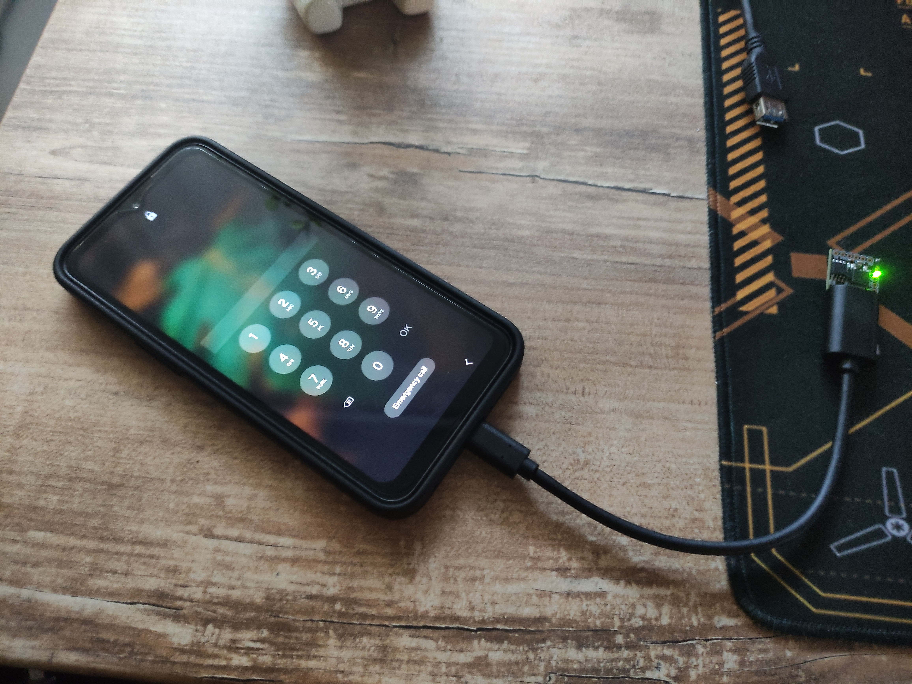

# EvilUSB PIN Brute-Force Tool for Digispark

This project uses a **Digispark USB (ATtiny85)** to simulate a keyboard and brute-force the lock screen PIN on older Android devices. 
It types common PINs and generated date-based combinations, automating input via USB HID emulation.

&nbsp;

> ⚠️ **DISCLAIMER:** This tool is for **educational and security testing purposes only**. Unauthorized use on devices you do not own may violate laws and ethical guidelines.

&nbsp;





---
## How It Works

- Sends a sequence of commonly used PIN codes.
- Generates additional PINs using date patterns: `DDMMYY` and `MMDDYY`.
- Uses `CMD + Backspace` (Win + Backspace) to quickly reset input and return to the home screen, avoiding stuck or unresponsive states.
- Sends `Arrow Up` to simulate a swipe-up gesture and bring up the PIN input screen again, speeding up retries and preventing errors.
- Designed for **older Android devices** without brute-force protections (e.g. no delays or lockouts after failed attempts).
    
&nbsp;

---
## Arduino IDE Setup Instructions

### 1. Install Arduino IDE
Download it from https://www.arduino.cc/en/software

&nbsp;

---
### 2. Add Your User to the `dialout` Group (Linux only)

Digispark uses serial communication that requires `tty` access.
```sh
sudo usermod -aG dialout $USER
```
After running the command, **log out and log back in**.

&nbsp;

> Note: This step grants your user permission to access serial (tty) devices, which is necessary for uploading code to Digispark. Without it, you may encounter "Permission denied" errors during the upload process.

&nbsp;

---
### 3. Add Udev Rules (Linux only)

Create the file:
```sh
sudo vim /etc/udev/rules.d/49-micronucleus.rules
```

Paste the following:
```sh
# Udev rules for Digispark boards
SUBSYSTEM=="usb", ATTR{idVendor}=="16d0", ATTR{idProduct}=="0753", GROUP="plugdev", MODE="0666"
```

Reload rules:
```sh
sudo udevadm control --reload-rules
```
&nbsp;

> Note: These udev rules ensure that the Digispark device is properly recognized by the system and can be accessed by your user without needing sudo. This is critical because Digispark only enters programming mode for a few seconds, and missing that window due to permission issues will cause the upload to fail.

&nbsp;

---
### 4. Add Digistump Board URL

In **Arduino IDE**:
- Go to `File > Preferences`
-  Under **Additional Board URLs**, paste: `https://raw.githubusercontent.com/digistump/arduino-boards-index/master/package_digistump_index.json`

⚠️ Older URL (`http://digistump.com/package_digistump_index.json`) is deprecated.

&nbsp;

---
### 5. Install Digistump Board Support

- Go to `Tools > Board > Boards Manager`
- Search for `Digistump AVR Boards`
- Click **Install**

&nbsp;

---
### 6. Upload the Sketch

- Go to `Tools > Board` and select `Digispark (Default - 16.5MHz)`
- **Do NOT plug in Digispark yet**
- Click **Upload** first, **then** quickly plug in your Digispark

&nbsp;

**TIP:**  
If you see an error like:
```
{runtime.tools.micronucleus.path} not found
```

Try resetting Arduino config:
```sh
rm -r ~/.arduino15
```
Then re-install the Digistump board support.

&nbsp;

---
## ⚠️ Upgrading the Micronucleus Bootloader (Fix for version 2.2 error)

If you get this warning:
```
Warning: device with unknown new version of Micronucleus detected.
This tool doesn't know how to upload to this new device. Updates may be available.
Device reports version as: 2.2 or 2.3
```


Follow this fix (source: [https://kovo-blog.blogspot.com/2019/01/how-to-upgrade-bootloader-on-digistump.html](https://kovo-blog.blogspot.com/2019/01/how-to-upgrade-bootloader-on-digistump.html)):
```sh
mkdir ~/tmp && cd ~/tmp
git clone https://github.com/micronucleus/micronucleus.git
cd micronucleus/commandline/
make

cd ~/.arduino15/packages/digistump/tools/micronucleus/2.0a4/
mv micronucleus micronucleus.old
cp ~/tmp/micronucleus/commandline/micronucleus .
```

Now uploading should work with newer Digispark versions.

&nbsp;

---
## PIN Strategy

This tool offers **three different brute-force strategies** for unlocking PIN-protected devices:

&nbsp;

### Version 1: Smart 6-digit attack
- Tries the most common PINs (e.g. 123456, 000000, 111111, etc.)
- Includes date-based PINs, generated using realistic birthdate formats:
- Formats:
     - DDMMYY (e.g. 100185 = January 10, 1985)
     - MMDDYY (e.g. 011085 = January 10, 1985 in US format)
- This ensures broader coverage of common user-chosen PINs based on birthdays and important dates.

&nbsp;
        
### Version 2: Full 6-digit brute-force
- Attempts every combination from `000000` to `999999`

&nbsp;

### Version 3: Full 4-digit brute-force
- Attempts every combination from `0000` to `9999`
- Uses `CMD + Backspace` to bypass Android error UI and retry faster
    
> Tested on Samsung devices where **no Enter key is required** for PIN submission and the screen can be activated via keyboard.

&nbsp;

---
## Compatibility

This script is designed for **older Android devices**, typically running **Android 9 (Pie) or earlier**, that:
- Do **not enforce delays** after multiple failed PIN attempts
- Do **not trigger data wipe or lockout** mechanisms
- Do **not randomize** the PIN keypad layout

&nbsp;

> ⚠️ **This project is purely educational** and intended as a technical challenge to create a self-contained brute-force gadget using a USB-based tool (like Digispark) that simulates keyboard input.

&nbsp;

### ⚙️ Behavior on Newer Devices

Modern Android versions (10 and above) include enhanced security measures, such as:
- Timed lockouts after several incorrect attempts
- Permanent lockout or **data wipe triggers** after too many failures
- **Randomized PIN layout** to prevent automated input strategies
- Inability to simulate input if USB debugging is not enabled

&nbsp;
    
> In theory, restarting the phone after every ~5 incorrect attempts might reset the retry counter, but this approach is **untested** and **not the goal** of this project.

&nbsp;


### 🧩 General Use Cases

This strategy can be adapted for **any system that uses PIN entry** and accepts **USB keyboard input**, such as:
- Phones and tablets with USB OTG support
- Smart locks or embedded devices with PIN input
- Any hardware accepting HID keyboard signals
    
Since Digispark acts as a USB keyboard, you can customize the code to send an **Enter key** after each PIN input if the target device requires it.

&nbsp;

---
## Legal and Ethical Notice

This code is provided **solely for educational and security research**.  
Do **not** use it on devices you do not own or have explicit permission to test.  
Always verify the legality of your actions in your jurisdiction.

&nbsp;

---
